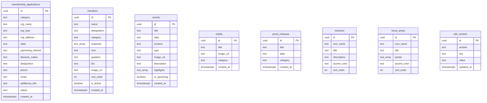
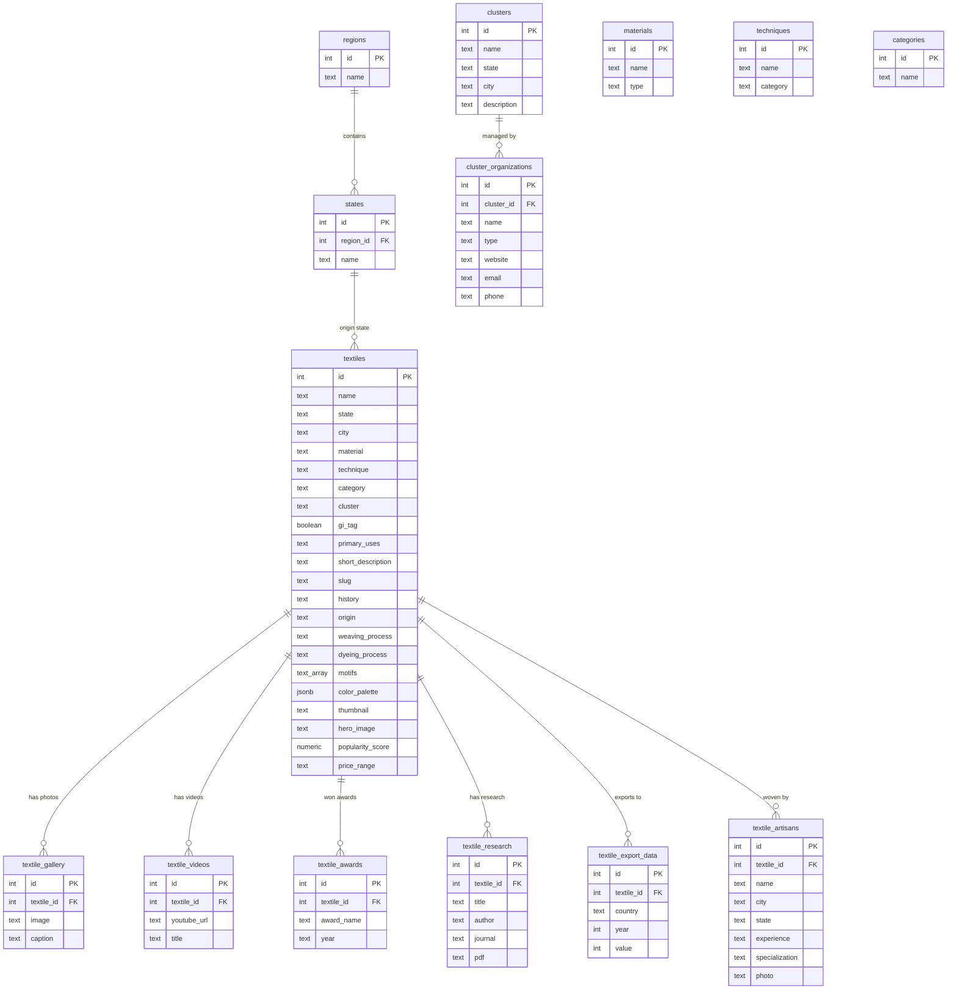

# Project Context: Vibrant Textiles Association (VTA)

This document serves as the primary source of truth and reference file for AI coding assistants (such as Cursor, Windsurf, Claude Dev/Cline, Copilot) to understand the project structure, database schemas, coding standards, and business logic of the Vibrant Textiles Association (VTA) web application.

---

## 1. Project Overview & Business Logic

The **Vibrant Textiles Association (VTA)** website is a modern, responsive React web application. It serves as a unified digital ecosystem connecting artisans, manufacturers, exporters, and policymakers to showcase, explore, and manage India's textile heritage.

### Core Portals
The application dynamically toggles between two main operational states managed globally via a React Context:
1. **Industry Portal (`industry`)**: Focused on textile exploration, cluster organizations, industry events, media, and research publications.
2. **Academy Portal (`academy`)**: Focused on skill development (RPL, training programs), apprenticeships, placements, and academic affiliations.

### Key Features
- **Textile Explorer**: A comprehensive filterable grid and list view of traditional Indian handlooms (with GI Tag details, price ranges, popularity scores, and regional classifications).
- **Interactive India Map**: An SVG-based regional map allowing users to select and filter textiles by geographic regions (North, South, East, West, Central, Northeast).
- **Admin CMS Dashboard**: A secure portal (`/admin`) for authorized users to manage site content, membership applications, board members, events, media gallery, press releases, skill development programs, and research publications.
- **Supabase Backend**: Real-time data storage, Row-Level Security (RLS) policies, and user authentication for admin pages.

---

## 2. Tech Stack

- **Frontend Core**: [React](https://react.dev) (v19) & [Vite](https://vite.dev) (v7)
- **Routing**: [React Router DOM](https://reactrouter.com) (v7)
- **Styling**: [Tailwind CSS](https://tailwindcss.com) (v4) with `@tailwindcss/postcss` for compilation.
- **Animations**: [Framer Motion](https://www.framer.com/motion/) (v12) and [Lenis](https://lenis.darkroom.engineering) for smooth scrolling.
- **Backend/DB**: [Supabase](https://supabase.com) (PostgreSQL database, storage buckets, and client SDK).
- **Icons**: [FontAwesome React](https://fontawesome.com) components.

---

## 3. Directory Layout & Key Modules

```
vibrant-textiles/
├── src/
│   ├── admin/                # Admin Panel Layouts and Sub-Views
│   │   ├── AdminDashboard.jsx
│   │   ├── AdminLayout.jsx
│   │   ├── AdminLogin.jsx
│   │   ├── ProtectedRoute.jsx # Route guard verifying Supabase auth
│   │   └── Admin*.jsx        # Resource-specific CMS editors (Members, Events, Media, etc.)
│   ├── assets/               # Local SVGs (logos, map indicators) and static assets
│   ├── components/           # Reusable UI Components
│   │   ├── Navbar.jsx        # Handles responsive header & portal-mode layout toggling
│   │   ├── Footer.jsx
│   │   ├── Hero.jsx          # Frontpage landing banner with stats
│   │   ├── InteractiveIndiaMap.jsx # Interactive SVG India map
│   │   ├── SmoothScroll.jsx  # Lenis smooth-scrollbar wrapper
│   │   └── *                  # FocusAreas, Mission, Loader, Members, etc.
│   ├── context/
│   │   └── PortalContext.jsx # Global state provider for portalMode ('industry' | 'academy')
│   ├── data/                 # Data adapter and static structures
│   │   ├── textileDatabase.js # Core client DB query functions (Supabase calls & fallbacks)
│   │   └── *.csv / *.sql / *.json # Seed sources and database scripts
│   ├── lib/
│   │   └── supabase.js       # Client instantiation using environment variables
│   ├── pages/                # Public page components
│   │   ├── Home.jsx
│   │   ├── TextileExplorer.jsx # Main catalog with advanced multi-select filtering
│   │   ├── TextileDetail.jsx   # Rich view for specific textiles (history, process, motifs, gallery)
│   │   ├── Membership.jsx      # Dynamic form submitting applications to Supabase
│   │   ├── Events.jsx
│   │   ├── SkillDevelopment.jsx
│   │   ├── AboutTextile.jsx
│   │   └── OtherPages.jsx      # Holds Media, Research, and Contact pages
│   ├── App.jsx               # Entry-level routing map (public and protected paths)
│   ├── index.css             # Main stylesheet (Tailwind imports and custom @theme definition)
│   └── main.jsx              # App mount point
├── supabase_schema.sql       # SQL code for setting up CMS tables & RLS policies
├── supabase_textiles_setup.sql # SQL code for the rich Textile Explorer database
├── package.json
├── vite.config.js
└── postcss.config.js
```

---

## 4. Database Schema (Supabase / PostgreSQL)

The database consists of two core schemas deployed under the public namespace:

### CMS & Applications Schema (`supabase_schema.sql`)



### Textiles & Craftsmanship Database (`supabase_textiles_setup.sql`)



### Row Level Security (RLS) Rules
- **Public access (anonymous)**: Can perform read operations (`SELECT`) on all data tables, and `INSERT` on `membership_applications`.
- **Authenticated access (admin)**: Full administrative rights (`SELECT`, `INSERT`, `UPDATE`, `DELETE`) across all tables.
- **Storage Buckets**: A public storage bucket named `cms-images` exists. Authenticated users are allowed to upload and delete files.

---

## 5. Critical Codebase Architecture Details

### Tailwind CSS v4 Configuration (IMPORTANT)
Unlike Tailwind v3, this project uses **Tailwind CSS v4**.
- **No `tailwind.config.js` exists** in the root folder.
- All customizations (colors, variables, utility classes, and custom components) are defined in [src/index.css](file:///d:/Project/VibrantTextiles/src/index.css) using the CSS-native `@theme` directive.
- If you need to add custom colors or values, edit [src/index.css](file:///d:/Project/VibrantTextiles/src/index.css):
  ```css
  @theme {
    --color-primary-600: #e11d48;
    --color-custom-brand: #8b5cf6;
  }
  ```

### Portal Context
The UI changes layout structure, navigation options, and links depending on the portal mode.
- Access the context state via `const { portalMode, setPortalMode } = usePortal();` from [src/context/PortalContext.jsx](file:///d:/Project/VibrantTextiles/src/context/PortalContext.jsx).
- The portal mode toggler is rendered inside the desktop and mobile views of [src/components/Navbar.jsx](file:///d:/Project/VibrantTextiles/src/components/Navbar.jsx).

### Database Data Adapter
- [src/data/textileDatabase.js](file:///d:/Project/VibrantTextiles/src/data/textileDatabase.js) handles DB client-side queries.
- Contains helper function `getLocalImages` to map database entry fields to local static assets if database image URLs are invalid or empty.
- Always implement robust fallbacks in async fetchers to prevent frontend crashes if database records have null fields (refer to `getTextileBySlug` implementation).

---

## 6. Coding Standards for AI Development

When generating, modifying, or refactoring code:

1. **React 19 Hooks & Rendering**:
   - Use standard React 19 rules. Keep components clean, utilize functional architecture, and use custom hooks if state logic grows too complex.
   - Clean up event listeners in `useEffect` returns (e.g., in click-outside triggers or resize handlers).

2. **Tailwind v4 Styling**:
   - Do not write custom inline CSS style objects unless working with dynamic numbers (like slider percentages or coordinate positions). Use Tailwind utility classes.
   - Utilize predefined utility styles from [src/index.css](file:///d:/Project/VibrantTextiles/src/index.css) such as `.glass-panel`, `.glass-card`, `.section-container`, `.btn-primary`, and `.text-gradient`.

3. **Supabase Ingestion & Queries**:
   - Write clean, non-blocking asynchronous calls.
   - Always wrap Supabase fetches in `try...catch` blocks.
   - Handle empty results or failures gracefully (e.g., navigate back, display custom loaders/skeletons, or use placeholder elements).

4. **Animations (Framer Motion)**:
   - Use `motion.div` for transition elements, cards, and sliders.
   - Enclose lists or toggle banners in `<AnimatePresence>` when animate elements are entering or leaving the viewport.
   - Set transitions explicitly (`duration`, `ease`) to maintain smooth, high-fidelity UI animations.

5. **Icon Library**:
   - Use `FontAwesomeIcon` from `@fortawesome/react-fontawesome` for icons.
   - Ensure the required icon is imported from `@fortawesome/free-solid-svg-icons` or `@fortawesome/free-brands-svg-icons`.

---

## 7. Operational Commands

### Environment Setup
Create a `.env` file in the root directory (based on environment config rules, ignored by Git):
```env
VITE_SUPABASE_URL=your_supabase_project_url
VITE_SUPABASE_ANON_KEY=your_supabase_anonymous_key
```

### Script Commands
Run these commands from the root directory:

```bash
# Install dependencies
npm install

# Start local Vite development server
npm run dev

# Build production bundle
npm run build

# Preview the built production application locally
npm run preview

# Run ESLint validation
npm run lint
```
